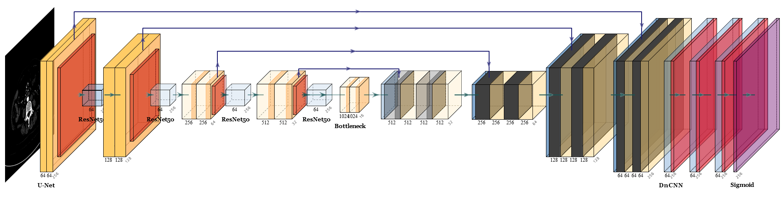

# RUD-Net

By XianTao Chen

This repository contains an official implementation of RUD-Net of paper 
["基于深度学习的骨骼语义分割"]()



## Quick start

### Environment

This code is developed using on **Python 3.8** and Pytorch 1.8.0 on Ubuntu 20.04.6 with NVIDIA GPUs. Training and testing are performed using 1 GeForce GTX 3060 GPU with CUDA 11.3. Other platforms or GPUs are not tested.

### Install

1. Install [conda](https://docs.conda.io/projects/conda/en/latest/user-guide/install/download.html)
2. Install dependencies

```shell
conda env create -f environment.yaml
conda activate RUD
```


### Data

1. Make a `dataset` directory.

```shell
mkdir dataset
```

1. Download the [Hospital CT](https://drive.google.com/drive/folders/14j_Wub88ldKDddD8foszYXtRMb1Mqo-u?usp=sharing) into `dataset`.
2. Your `dataset` directory should look like this:

````
AADG
-- dataset
   |-- RVS
   |   |-- CHASEDB1
   |   |-- DRIVE
   |   |-- HRF
   |   |-- STARE
   |-- Fundus
   |   |-- Domain1
   |   |-- Domain2
   |   |-- Domain3
   |   |-- Domain4  

````

### Train

Please specify the configuration file in ```experiments```.

```shell
python run.py --cfg <CONFIG-FILE> --output_dir <CUSTOM-OUTPUT-DIR>
```

For example,

```shell
python run.py --cfg experiments/rvs_sinkhorn/diversity_ex.yaml --output_dir output/
```

## Citation
If you find this repository useful, please consider citing AADG paper:

```
@ARTICLE{9837077,
  author={Lyu, Junyan and Zhang, Yiqi and Huang, Yijin and Lin, Li and Cheng, Pujin and Tang, Xiaoying},
  journal={IEEE Transactions on Medical Imaging}, 
  title={AADG: Automatic Augmentation for Domain Generalization on Retinal Image Segmentation}, 
  year={2022},
  volume={},
  number={},
  pages={1-1},
  doi={10.1109/TMI.2022.3193146}}
```
Footer
© 2023 GitHub, Inc.
Footer navigation
Terms
Privacy
Security
Status
Docs
Contact GitHub
Pricing
API
Training
Blog
About
AADG/README.md at main · CRazorback/AADG 


##unet
CUDA_VISIBLE_DEVICES=5 python train.py --model_path=/home/extends/cxt/model/unet/model_new_8_withtest_512 --output_img_path=/data2/cxt/CT/hospital_data_clean/png/pred_unet


#finetune
CUDA_VISIBLE_DEVICES=5 python train_finetune.py --model_path=/home/extends/cxt/model/unet/model_new_8_withtest_512 --output_img_path=/data2/cxt/CT/hospital_data_clean/png/pred_unet_finetune --save_model_path=/home/extends/cxt/model/unet_fine/unet_finetune_model

#finetunefinalconv
CUDA_VISIBLE_DEVICES=5 python train_finetunefinalconv.py --model_path=/home/extends/cxt/model/unet/model_new_8_withtest_512 --output_img_path=/data2/cxt/CT/hospital_data_clean/png/pred_unet_finetunefinalconv --save_model_path=/home/extends/cxt/model/unet_fine/unet_finetunefinalconv_model

#unet_resnet
训练：
CUDA_VISIBLE_DEVICES=1 python train.py --model_path=/home/extends/cxt/model/unet_resnet/model_new_8_withtest_512
验证：
CUDA_VISIBLE_DEVICES=5 python train.py --model_path=/home/extends/cxt/model/unet_resnet/model_new_8_withtest_512 --output_img_path=/data2/cxt/CT/hospital_data_clean/png/pred_unet_resnet

#resnet_finetune
训练：
CUDA_VISIBLE_DEVICES=5 python train_finetune.py --model_path=/home/extends/cxt/model/unet_resnet/model_new_8_withtest_512 --output_img_path=/data2/cxt/CT/hospital_data_clean/png/pred_unet_resnet_finetune --save_model_path=/home/extends/cxt/model/unet_resnet_fine/unet_resnet_finetune_model
验证：
同上，只需把CHECK_ACC=TRUE即可

#resnet_finetunefinalconv
训练：
CUDA_VISIBLE_DEVICES=5 python train_finetunefinalconv.py --model_path=/home/extends/cxt/model/unet_resnet/model_new_8_withtest_512 --output_img_path=/data2/cxt/CT/hospital_data_clean/png/pred_unet_resnet_finetunefinalconv --save_model_path=/home/extends/cxt/model/unet_resnet_fine/unet_resnet_finetunefinalconv_model
验证：
同上，只需把CHECK_ACC=TRUE即可