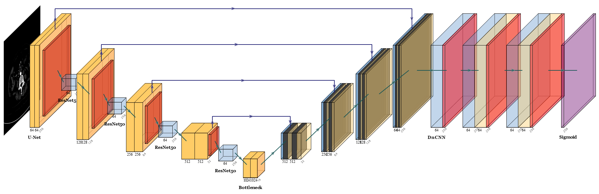

# RUD-Net

By XianTao Chen

This repository contains an official implementation of RUD-Net of paper 
["基于深度学习的骨骼语义分割"]()




## Quick start

### Environment

This code is developed using on **Python 3.8** and Pytorch 1.11.0 on Ubuntu 20.04.6 with NVIDIA GPUs. Training and testing are performed using 1 GeForce GTX 3060 GPU with CUDA 11.3. Other platforms or GPUs are not tested.

### Install

1. Install [conda](https://docs.conda.io/projects/conda/en/latest/user-guide/install/download.html)
2. Install dependencies

```shell
conda env create -f environment.yaml
conda activate RUD
```


### Data

1. Into the dataset
    ```shell
    cd dataset
    ```
2. Download the [Hospital CT](https://drive.google.com/drive/folders/1dhHkyqxFGOsk7dSmSxcFLB_eVh0hV4jp?usp=share_link) into `dataset`. 
3. Run all the **Jupyter Notebook**  documents in order:

     ```1. data_for_3Dircadb1.ipynb```
     ```2. data_for_hospital_data.ipynb```
     ```3. mask_bone_for_hospital_data.ipynb```
4. Your `dataset` directory should look like this:

````
code
-- dataset
   |-- CTDircadb1
   |   |-- mask
   |   |-- origin
   |   |-- test
   |       |-- mask
   |       |-- origin
   |       |-- pred
   |
   |-- hospital_data_clean
   |   |-- dcm
   |       |-- mask
   |       |-- origin
   |       |-- rebi_mask
   |   |-- png
   |       |-- origin
   |       |-- mask
   |       |-- rebi_mask
   |       |-- mask_bone
   |       |-- finetune
   |           |-- train
   |               |-- mask
   |               |-- origin
   |           |-- test
   |               |-- mask
   |               |-- origin
````

### Train

Please specify the configuration in ```train.py``` or ```train_XXX.py``` for each document.
Attention:
1. the ```CHECK_ACC = True``` and ```NEW_DATA = True``` should be check.
2. the ```XXX_IMG_DIR``` and ```XXX_MASK_DIR``` in ```train.py``` should be change.
```shell
##unet
python train.py --model_path=../unet/model_new_8_withtest_512 --output_img_path=hospital_data_clean/png/pred_unet
```

```shell
#finetune
python train_finetune.py --model_path=../unet/model_new_8_withtest_512 --output_img_path=hospital_data_clean/png/pred_unet_finetune --save_model_path=../unet_fine/unet_finetune_model
```

```shell
#finetunefinalconv
python train_finetunefinalconv.py --model_path=../unet/model_new_8_withtest_512 --output_img_path=hospital_data_clean/png/pred_unet_finetunefinalconv --save_model_path=../unet_fine/unet_finetunefinalconv_model
```

```shell
#unet_resnet
# For train
python train.py --model_path=../unet_resnet/model_new_8_withtest_512

# For test
python train.py --model_path=../unet_resnet/model_new_8_withtest_512 --output_img_path=hospital_data_clean/png/pred_unet_resnet
```

```shell
#resnet_finetune
# For train
python train_finetune.py --model_path=../unet_resnet/model_new_8_withtest_512 --output_img_path=hospital_data_clean/png/pred_unet_resnet_finetune --save_model_path=../unet_resnet_fine/unet_resnet_finetune_model

# For test
# let CHECK_ACC=TRUE
```

```shell
#resnet_finetunefinalconv
# For train
python train_finetunefinalconv.py --model_path=../unet_resnet/model_new_8_withtest_512 --output_img_path=hospital_data_clean/png/pred_unet_resnet_finetunefinalconv --save_model_path=../unet_resnet_fine/unet_resnet_finetunefinalconv_model

# For test
# let CHECK_ACC=TRUE
```